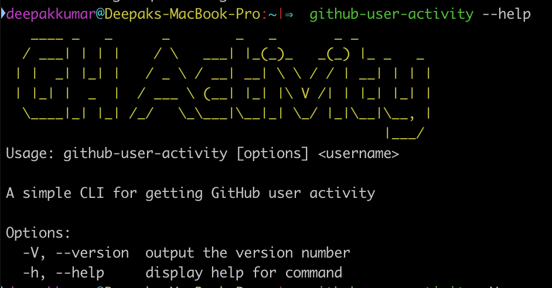
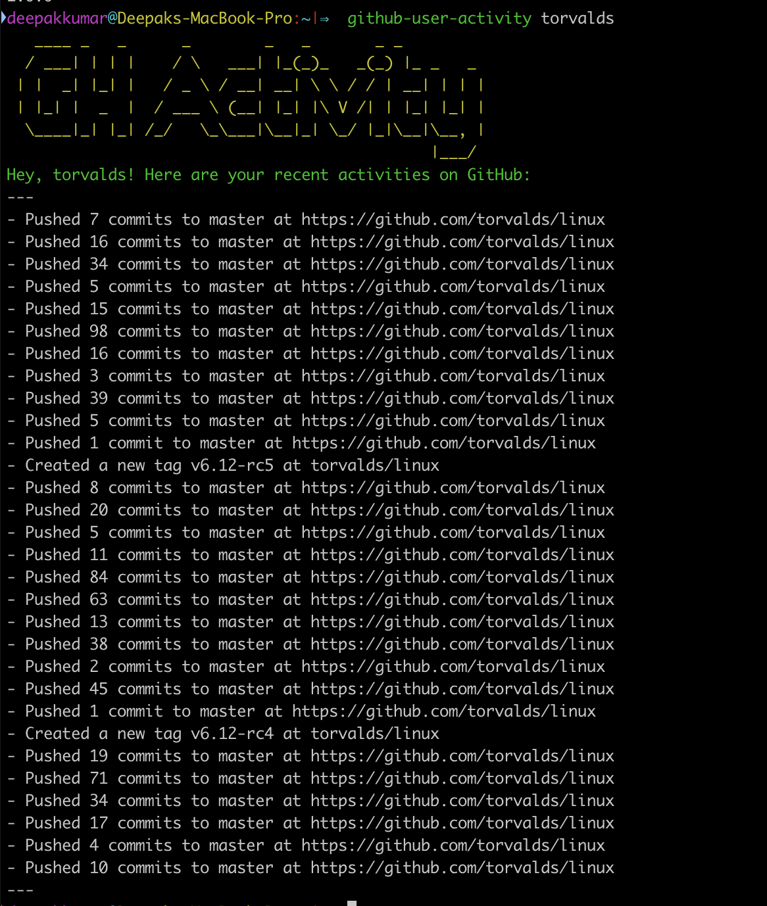
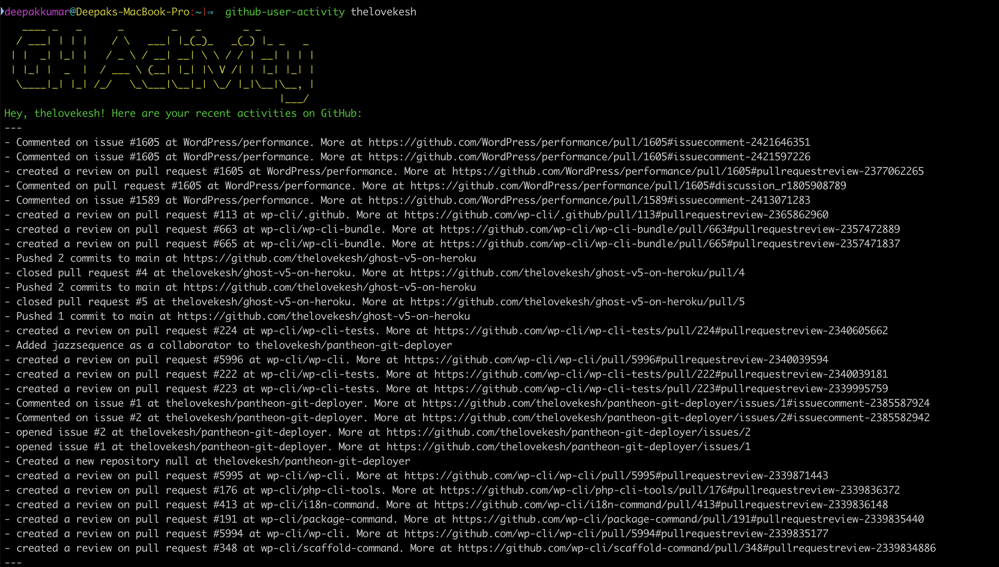

# GitHub Activity CLI
A simple Nodejs CLI application to fetch GitHub user activity. Inspired from https://roadmap.sh/projects/github-user-activity



## Installation

1. Clone this repo
2. `npm install`
3. `npm link` - This links the `github-user-activity` command to your terminal.

## Usage

```
github-user-activity <username>
```

## Examples

```
github-user-activity torvalds
```



```
github-user-activity thelovekesh
```

